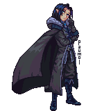
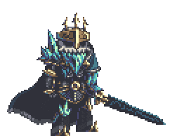
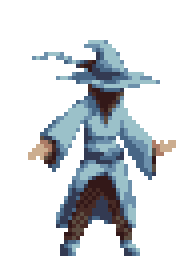
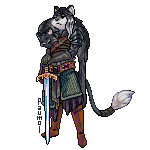
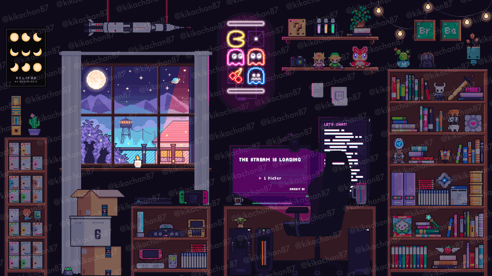
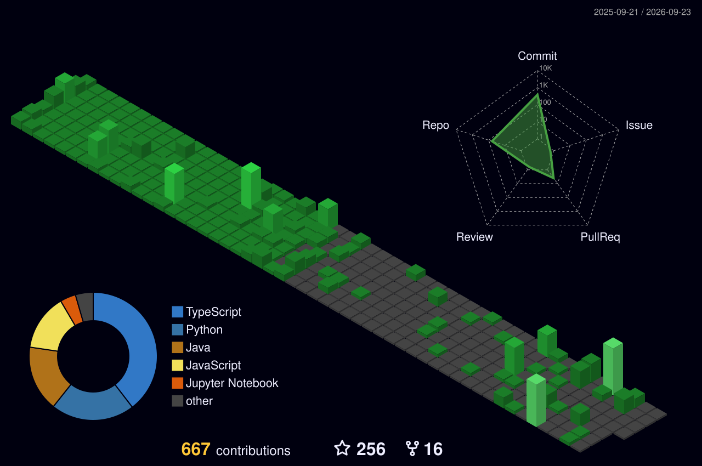
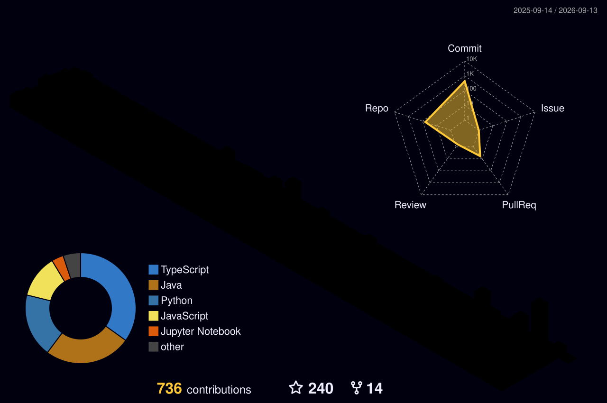
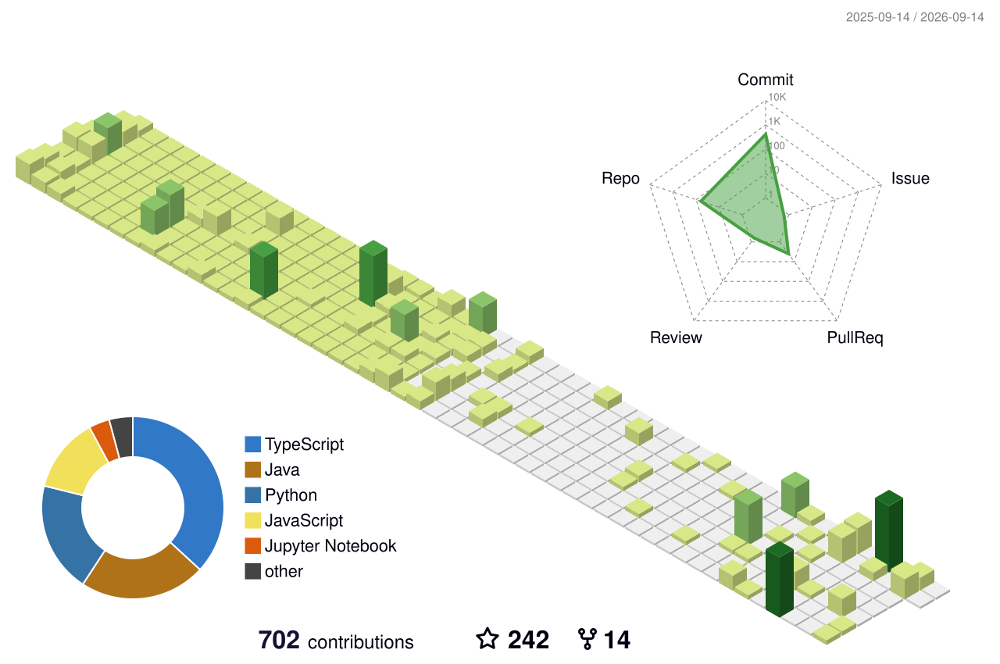
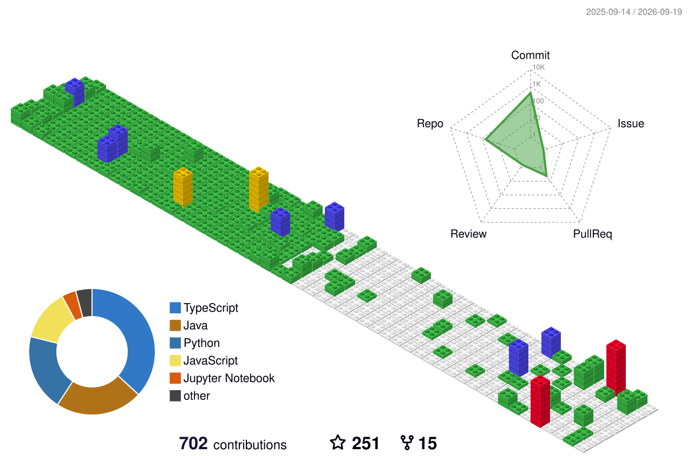

 

<!-- Typing SVG by DenverCoder1 - https://github.com/DenverCoder1/readme-typing-svg -->

 
 
  

<h1 align="center">Hi There! &nbsp;&nbsp;&nbsp;I'm </h1>

<h3 align="center">

</h3>

<h3 align="center"><strong> A Passionate Developer from India  </strong> </h3>

  

  

 

### 🧑‍💻 About Me

- 🎓 **Computer Science Student** passionate about building scalable software solutions
- 📍 Based in **Lucknow, Uttar Pradesh, India** 🇮🇳
- 🌱 Currently diving deep into **Cloud Architecture, System Design & AI/ML**
- 💡 I love exploring new technologies and solving complex problems
- 🏆 Active **Open Source Contributor** — always looking to collaborate
- 🔭 Building production-grade **Full Stack & Cloud-Native Applications**
- 📫 Reach me at **kk3163019@gmail.com**
- ⚡ Fun fact: I debug with music on 🎧 and coffee in hand ☕

 

  

  
  
  

 

<!-- 3D Profile Stats Card -->

 

<!-- 3D Full Profile Card -->

---

<h2 align='center'><strong>🌐 Socials & Coding Profiles</strong></h2>

 

---

<h2 align='center'><strong>🛠️ Tech Stack & Arsenal</strong></h2>

 

<table>
	<tr>
		<td><strong>💻 Programming Languages</strong></td>
		<td>
			
			
			
			
			
			
		</td>
	</tr>
	<tr>
		<td><strong>🎨 Frontend</strong></td>
		<td>
			
			
			
			
			
		</td>
	</tr>
	<tr>
		<td><strong>⚙️ Backend & Frameworks</strong></td>
		<td>
			
			
			
		</td>
	</tr>
	<tr>
		<td><strong>🗄️ Databases</strong></td>
		<td>
			
			
		</td>
	</tr>
	<tr>
		<td><strong>☁️ Cloud & DevOps</strong></td>
		<td>
			
			
			
			
			
		</td>
	</tr>
	<tr>
		<td><strong>🔧 Dev Tools</strong></td>
		<td>
			
			
			
			
			
			
		</td>
	</tr>
	<tr>
		<td><strong>🤝 Collaboration</strong></td>
		<td>
			
			
			
		</td>
	</tr>
</table>

 

---

<h2 align='center'><strong>🎨 Pixel Art Gallery</strong></h2>

<i>Custom-made animated pixel art GIFs — crafted with code & creativity</i>

 

  <table width="100%">
    <tr>
      <td width="50%" align="center">
        
         
        <b>🏪 Pixel Mart — Rainy Night</b>
         Neon signs pulsing • Shiba Inu sitting • Warm shop glow
      </td>
      <td width="50%" align="center">
        
         
        <b>🌸 Sakura Samurai — Moonlit Village</b>
         Falling petals • Lantern flicker • Castle & moon glow
      </td>
    </tr>
    <tr>
      <td width="50%" align="center">
        
         
        <b>⚡ Cyberpunk Neon Samurai</b>
         Neon katana energy • Cyber rain • Digital sparks
      </td>
      <td width="50%" align="center">
        
         
        <b>☕ Lofi Coder Room</b>
         Sleeping cat • Rain on window • Equalizer beats
      </td>
    </tr>
    <tr>
      <td width="50%" align="center">
        
         
        <b>🔮 Mystic Dark Elf Sorcerer</b>
         Swirling magic orb • Cosmic moon • Arcane energy
      </td>
      <td width="50%" align="center">
        
         
        <b>💻 Coder Workspace — Night Shift</b>
         Monitor glow • Head bobbing • Coffee steam rising
      </td>
    </tr>
    <tr>
      <td width="50%" align="center">
        
         
        <b>🌅 Rooftop Sunset — Tokyo Vibes</b>
         Neon signs • Lantern flame • Twinkling stars
      </td>
      <td width="50%" align="center">
        &nbsp;
      </td>
    </tr>
  </table>

---

<h2 align='center'><strong>🚀 Featured Projects</strong></h2>

 

  <table width="100%">
    <tr>
      <td width="50%" align="center">
        
         
        <b>🛒 QuickShop</b> — Full-Stack E-Commerce Platform
         React • Django • MongoDB • AWS
      </td>
      <td width="50%" align="center">
        
         
        <b>🔍 OpenDiscover</b> — Modern Discovery Platform (⭐ 49+)
         JavaScript • REST API • Open Source
      </td>
    </tr>
    <tr>
      <td width="50%" align="center">
        
         
        <b>🎉 EventProject</b> — Contest & Event Management System
         Python • Django • MySQL
      </td>
      <td width="50%" align="center">
        
         
        <b>🏢 Open-Mercato</b> — AI-Supportive Enterprise CRM/ERP
         Full Stack • AI Integration • Enterprise
      </td>
    </tr>
    <tr>
      <td width="50%" align="center">
        
         
        <b>📱 Shizuku Apps</b> — Rootless Android Power Tools
         Android • ADB • Shell
      </td>
      <td width="50%" align="center">
        
         
        <b>🩺 AI Medical Assistant</b> — Intelligent Healthcare Companion
         Python • AI/ML • Healthcare
      </td>
    </tr>
  </table>
   
  

---

 
 

<h2 align='center'><strong>📊 GitHub Analytics</strong></h2>

 

<!-- GitHub Streak Stats -->

  

<!-- Profile Summary Cards -->

  

<!-- Profile Details -->

  

<!-- 3D Contribution Graphs -->
<h3>🌟 3D Contribution Skyline</h3>
 

  

  

  

  

<!-- GitHub Activity Graph -->

  

<!-- GitHub Trophies -->

  

<!-- Snake Animation -->

		
<picture>
  <source media="(prefers-color-scheme: dark)" srcset="https://raw.githubusercontent.com/krishna3163/krishna3163/output/github-contribution-grid-snake-dark.svg" />
  <source media="(prefers-color-scheme: light)" srcset="https://raw.githubusercontent.com/krishna3163/krishna3163/output/github-contribution-grid-snake.svg" />
  
</picture>

---

<h2 align='center'><strong>🤝 Let's Connect & Build Together</strong></h2>

 

  

> *"Code is like humor. When you have to explain it, it's bad."* — Cory House

 

